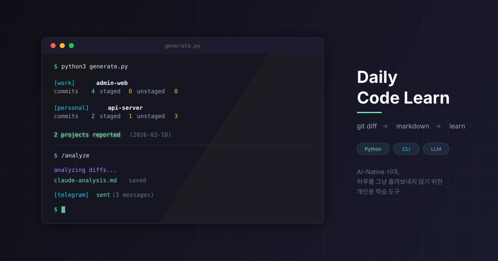

# Daily Code Learn

<p align="center">
  
</p>

[English README](../README.md)

매일 퇴근 전 터미널 명령 한 번으로 오늘 작업한 코드를 프로젝트별 마크다운으로 정리하는 CLI 도구.
생성된 마크다운은 Claude, Codex 등에 직접 던져서 분석 가능.

## 요구 사항

- `PATH`에서 실행할 수 있는 Git 2.37.0 이상
- Python 3.10 이상 (CI 검증 범위: Python 3.10~3.14)
- macOS 또는 Linux
- 동일 디렉터리 하드 링크, 원자적 교체, 디렉터리 `fsync`를 지원하는
  `outputDir` 파일시스템

## 특징

- Python3 표준 라이브러리만 사용 (의존성 0개)
- 직계 Git 저장소를 기본 탐색하고 `roots[].maxDepth`로 제한된 재귀 탐색 지원
- 일반 저장소(`.git` 디렉터리)와 연결된 worktree(`.git` 파일) 지원
- 실행 시 `git fetch`로 원격 브랜치 동기화 — pull 없이도 다른 환경에서 push한 커밋 탐지
- 커밋 이력, staged/unstaged 변경 파일, untracked 파일 목록을 마크다운으로 출력
- 읽기 쉬운 저장소 식별자와 결정적 해시로 같은 프로젝트명의 리포트 충돌 방지
- 터미널 출력에 ANSI 색상 적용 (성공/경고/에러 구분)
- 텔레그램 봇을 통한 분석 결과 전송, 필요 시 리포트 전송 (선택)
- Claude Code·Codex 스킬 내장 — `/analyze`, `/dig`, `/publish`, `/scrum`. 리포트를 학습 노트, 프로젝트별 후속 질문 세션, 스크럼 요약으로 바꾼다

## 5분 Quickstart

```bash
git clone https://github.com/gonasooc/daily-code-learn-oss.git
cd daily-code-learn-oss

# 설정 파일 생성
python3 generate.py --init

# config/profiles.json에서 roots[].path, authorNames, authorEmails 수정

# 설정 점검
python3 generate.py --doctor

# 오늘 기준 리포트 생성
python3 generate.py
```

생성 결과는 다음 경로에 저장된다.

```text
reports/{날짜}/{root--저장소-상대-경로-slug}--{16자리 해시}.md
```

ASCII slug는 `root 이름--저장소 상대 경로`에서 만들고 경로 경계에는 `--`를
사용한다. 그 밖의 안전하지 않은 연속 문자는 `-`로 바꾸고 최대 160자로
제한한다. 뒤의 16자리는 정확한 root/저장소 식별자의 SHA-256 앞부분이므로
slug가 정규화되거나 잘린 이름에 안정적인 구분자를 더한다. 그래도 한 실행에서
최종 파일명이 충돌하면 덮어쓰지 않고 실패로 처리한다. 로컬 절대 경로는
파일명이나 리포트 기본 정보에 기록하지 않는다.

## 실행 방법

```bash
# 버전 확인
python3 generate.py --version

# 설정 파일 생성
python3 generate.py --init

# 설정/환경 점검
python3 generate.py --doctor

# 오늘 기준 리포트 생성
python3 generate.py

# 특정 날짜 기준
python3 generate.py --date 2026-03-12

# 과거 날짜 리포트에 현재 작업 트리를 명시적으로 포함
python3 generate.py --date 2026-03-12 --include-current-changes

# 생성 직후 리포트까지 보내고 싶을 때만
python3 generate.py --notify

# 최근 30일 기준 누락된 학습일 점검
python3 generate.py --check-missed

# 최근 14일 기준 누락된 학습일 점검
python3 generate.py --check-missed --days 14

# Git 실패 원인 등 상세 수집 로그 표시
python3 generate.py --verbose
```

`--check-missed`는 누락 날짜를 조회만 하지 않고, 선택한 날짜 하루치 리포트를 바로 생성한다.
`--days`는 1~3650 범위에서 지정할 수 있다.

ANSI 색상 출력을 끄려면 표준 `NO_COLOR` 환경변수를 정의한다.
리디렉션된 출력에도 색상이 필요하면 `FORCE_COLOR=1`, 명시적으로 끄려면
`FORCE_COLOR=0`을 사용한다.

```bash
NO_COLOR=1 python3 generate.py
FORCE_COLOR=1 python3 generate.py
```

## 초기 설정

```bash
# 설정 파일 생성
python3 generate.py --init
```

`config/profiles.json`을 본인 환경에 맞게 수정:

```json
{
  "roots": [
    {
      "name": "my-workspace",
      "path": "/path/to/repositories",
      "maxDepth": 2,
      "authorNames": ["My Name"],
      "authorEmails": ["my@email.com"]
    }
  ],
  "outputDir": "./reports",
  "report": {
    "includeUncommittedDiff": true,
    "includeSensitiveFiles": false,
    "maxDiffLines": 1200,
    "maxDiffBytes": 2097152
  },
  "exclude": ["node_modules", ".next", "dist", "build", "coverage",
              "package-lock.json", "yarn.lock", "pnpm-lock.yaml"],
  "telegram": {
    "enabled": false
  },
  "scrum": {
    "root": "work",
    "outputDir": "/path/to/notes/scrum"
  }
}
```

`reports/`와 `config/profiles.json`은 로컬 생성/설정 파일이므로 public 저장소에서는 추적하지 않는다.

설정이 맞는지 확인:

```bash
python3 generate.py --doctor
```

`--doctor`는 다음 항목을 점검한다:

- `PATH`에서 Git 2.37.0 이상을 실행할 수 있는지
- `config/profiles.json` 존재 여부와 JSON 파싱 가능 여부
- 각 필드의 타입과 허용 범위
- `roots[].path` 경로 존재 여부
- 발견한 `.git` marker가 실제로 사용할 수 있는 Git worktree인지, 각 root의
  설정 깊이 안에 고유하고 사용 가능한 저장소와 연결된 worktree가 몇 개인지
  (0개면 설정 실패로 표시)
- 같은 실제 저장소가 둘 이상의 설정 root에서 중복 발견되는지
- 비어 있지 않고 고유한 root 이름과 비어 있지 않은 author 필터
- `outputDir` 생성 및 읽기·쓰기·탐색 가능 여부
- 텔레그램 활성화 시 필요한 환경변수 존재 여부

일반 리포트 생성 전에도 스키마·경로·읽기·쓰기 가능 여부를 같은 로직으로 검증하고,
잘못된 설정은 저장소 탐색 전에 중단한다. `--doctor`는 여기에 author 예시 값과
텔레그램 환경변수 같은 초기 설정 점검을 추가한다.

| 필드 | 설명 |
|------|------|
| `roots[].name` | 콘솔과 리포트 경로에 사용하는 고유한 워크스페이스 이름 |
| `roots[].path` | Git 저장소와 worktree를 탐색할 디렉터리 |
| `roots[].maxDepth` | 최대 탐색 깊이. 직계 자식은 깊이 `1` (기본 `1`) |
| `roots[].authorNames` | 작성자 이름 |
| `roots[].authorEmails` | 커밋을 OR 조건으로 필터링할 Git 작성자 이메일 |
| `outputDir` | 리포트 저장 경로 |
| `report.includeUncommittedDiff` | staged/unstaged 변경의 diff 포함 여부 (기본 `true`) |
| `report.includeSensitiveFiles` | 일반적인 민감 파일을 리포트 데이터에 허용할지 여부 (기본 `false`) |
| `report.maxDiffLines` | 커밋/현재 변경 diff 블록의 최대 줄 수. `0`은 줄 제한 비활성화(별도 byte 제한은 적용) (기본 `1200`) |
| `report.maxDiffBytes` | diff 블록당 보존할 최대 raw byte 수. `0`은 byte 제한 비활성화 (기본 `2097152`, 2 MiB) |
| `exclude` | 파일 목록과 diff에서 제외할 glob/경로 패턴 |
| `telegram.enabled` | 텔레그램 전송 기능 사용 여부 (기본 `false`) |
| `scrum.root` | 선택. `/scrum` 스킬이 요약할 `roots[].name` |
| `scrum.outputDir` | 선택. `/scrum`이 `{날짜}.md`를 쓰는 디렉터리. 보통 `reports/` 밖의 노트 폴더 |

`scrum`은 선택 항목이다. `/scrum` 스킬만 읽고 `--doctor`는 검증하지 않는다.
블록이 없으면 스킬이 추측하지 않고 안내 후 멈춘다. 스크럼 요약은 학습 자료가
아니라 업무 기록이므로 `scrum.outputDir`는 보통 `reports/` 밖을 가리킨다.

`roots[].path`는 저장소 자체 또는 저장소들을 담은 디렉터리를 가리킬 수 있다.
어떤 디렉터리를 저장소로 인식하면 그 아래로는 더 탐색하지 않는다. 저장소가
중간 그룹 폴더 아래에 있다면 `maxDepth`를 늘린다. 깊이 제한은 관련 없는 깊은
디렉터리를 모두 순회하지 않게 한다. 같은 저장소를 중복 처리하지 않도록 경로
표기나 대소문자가 달라도 파일시스템 정체성이 같거나 서로 겹치는 root는 설정
오류로 처리한다.

`exclude`는 저장소 상대 경로에 대해 대소문자를 구분해 판정한다. `/`가 없는
패턴은 각 경로 세그먼트 전체에 적용하므로 `dist`는 `dist` 디렉터리를 제외하지만
`distribution`은 제외하지 않는다. `*.lock` 같은 셸 스타일 패턴도 같은 방식으로
동작한다. `/`가 있는 패턴은 저장소 상대 경로 전체와 디렉터리 경계에 맞는
접미 경로에 적용한다. 제외는 파일 목록과 파일 단위 diff 블록에 적용되며,
Git이 rename으로 감지한 변경은 이전·새 경로 중 하나라도 제외 대상이면 전체
diff 블록을 뺀다.

안전 기본값은 `.env`와 `.env.*`를 제외하되 `.env.example`, `.env.sample`,
`.env.template`은 허용하고, 일반적인 개인 키 ID, `*.pem`, `*.key`, `*.p12`,
`*.pfx`, credentials/service-account/secrets JSON·YAML 파일명을 제외한다.
`report.includeSensitiveFiles`를 `true`로 설정할 때만 이 기본값을 우회한다.
설정의 `exclude` 목록은 이 경우에도 항상 적용되며, 생성물과 프로젝트 고유의
민감 경로를 추가한다. 이 보호는 경로 기반이므로 파일 내용, 커밋 메시지,
브랜치 이름 안의 비밀값까지 검사하지는 않는다. 비밀 내용을 민감하지 않은
이름의 경로로 복사하면 기본 필터를 우회할 수 있으므로 프로젝트 전용 exclude를
추가해야 한다.

상대 `roots[].path`와 `outputDir`은 프로세스를 실행한 현재 작업 디렉터리를
기준으로 해석한다.

## 리포트 생성 조건

다음 중 하나라도 해당하면 해당 프로젝트의 리포트가 생성된다.

- 해당 날짜에 커밋이 1개 이상
- 현재 변경 포함 상태에서 staged 변경이 1개 이상
- 현재 변경 포함 상태에서 unstaged 변경이 1개 이상
- 현재 변경 포함 상태에서 untracked 파일이 1개 이상

오늘 날짜 리포트는 현재 작업 트리를 기본으로 포함한다. 과거 날짜를
`--date`로 지정한 경우에는 오늘의 staged/unstaged/untracked 상태가 당시
상태를 의미하지 않으므로 해당 날짜의 커밋만 포함한다. 과거 리포트에 현재
작업 트리가 정말 필요한 경우에만 `--include-current-changes`를 추가한다.

커밋 날짜는 실행 머신의 로컬 시간대 기준 committer date로 통일한다. 이
기준을 `--date` 필터, 리포트 표시 시간, 누락일 집계에 모두 사용하며 최신
커밋부터 출력한다. 여러 `authorEmails`는 OR 조건으로 한 번에 결합하고 같은
커밋은 한 번만 포함한다.

현재 변경을 포함할 때 staged/unstaged 변경은 기본적으로 파일 목록과 diff가
함께 출력되고, untracked 파일은 파일 목록만 출력된다.
각 diff 블록은 `report.maxDiffLines` 줄과 `report.maxDiffBytes` raw byte까지만
보존한다. 둘 중 하나에 도달하면 해당 Git diff 프로세스를 종료하고 나머지가
생략됐음을 기록한다.
`0`은 해당 제한만 비활성화한다.
커밋 전 변경 diff가 너무 길거나 민감한 경우 `report.includeUncommittedDiff`를 `false`로 설정하면 파일 목록만 남긴다.

리포트 기본 정보에는 로컬 절대 경로 대신 저장소 상대 경로가 표시되고, 설정한
작성자 이메일은 출력하지 않는다. 단, diff에는 소스 코드·자격 증명·개인
정보·로컬 문자열이 포함될 수 있으므로 외부 전송 전에 리포트를 확인하고
`exclude`를 관리한다.

같은 날짜를 다시 실행할 때 기존 일반 파일의 첫 두 줄에 날짜 헤더와 전체
identity marker가 같은 root·저장소와 일치하는 경우에만 생성 파일을 덮어쓴다.
생성 리포트를 편집할 때는 이 두 줄을 유지한다. 결정적 대상 경로를 검증할 때 다른
파일, 심볼릭 링크, 특수 파일이 있으면 교체하지 않고 실패한다. 다른 프로젝트 리포트나
분석 파일은 삭제하지 않는다. Daily Code Learn 실행끼리는 디렉터리 잠금으로
직렬화한다. 소유자 쓰기 파일과 마찬가지로 같은 OS 사용자로 실행되는 별도
프로세스는 파일시스템 신뢰 경계 안에 있으므로 생성 중 대상 경로를 변경하면 안 된다.
생성·누락일 판정·알림에서 날짜별 리포트
디렉터리 자체도 심볼릭 링크가 아닌 실제 디렉터리여야 한다. 기존에 생성된 프로젝트명 전용
`reports/{날짜}/{프로젝트}.md` 파일도 마이그레이션하거나 삭제하지 않고 누락일
판정에서 인식한다. 새 파일은 읽기 쉬운 식별자와 해시를 사용한다. 지원하는
파일시스템에서는 교체 가능한 리포트를 원자적으로 교체하고 소유자만 읽고 쓸 수
있는 `0600` 권한으로 저장한다. 새 날짜 디렉터리는 `0700` 권한으로 만들며,
현재 사용자 소유가 아니거나 그룹·기타 사용자에게 쓰기 권한이 있는 기존 날짜
디렉터리는 사용하지 않는다. 교체가 시작됐을 수 있는 시점에 게시가 중단되면 이전
inode를 숨김 복구 파일로 보존하며, 다음 실행은 복구 데이터를 누적하거나 임의로
삭제하지 않고 중단한다.

## 누락된 학습일 점검

`--check-missed`는 `작업은 했지만 리포트를 만들지 않은 날짜`를 찾고, 그중 오늘 진행할 날짜 1개를 골라 바로 리포트를 생성한다.

- 판정 단위는 프로젝트가 아니라 날짜 단위
- 기준 데이터는 최근 N일 동안 로컬 시간대 committer date와 author 이메일 OR 조건에 맞는 커밋
- `reports/{날짜}`의 `.md` 파일에 해당 날짜 생성 헤더와 현재의 전체 identity marker 또는 기존 리포트의 기본 정보 구조가 함께 있으면 누락 아님. 두 형식을 모두 인식하되 날짜 모양의 일반 메모는 리포트로 오인하지 않음
- 분석 파일은 위 생성 리포트 구조 중 하나를 의도적으로 흉내 내지 않는 한 리포트로 세지 않음
- 오늘은 아직 회고 전일 수 있으므로 기본 점검 범위에서 제외
- 최신 10개에 표시되지 않은 점검 범위 안의 날짜는 `YYYY-MM-DD`로 직접 입력해 선택
- `Enter`, `q`, `quit` 입력 시 생성 없이 종료
- 날짜를 선택하면 그 날짜만 기존 `--date YYYY-MM-DD` 흐름으로 바로 생성하고, 분석은 별도 단계로 진행

출력 예시:

```text
$ python3 generate.py --check-missed --days 14
[최근 14일] 작업했지만 리포트를 만들지 않은 날짜 2일 (2026-02-28 ~ 2026-03-13)

1. 2026-03-11: 프로젝트 1개, 커밋 1건
  프로젝트: work/admin-web
2. 2026-03-05: 프로젝트 2개, 커밋 4건
  프로젝트: work/api-server, personal/daily-code-learn

번호를 입력하거나 날짜(YYYY-MM-DD)를 직접 입력하세요. 취소하려면 Enter/q/quit
> 2
선택한 날짜: 2026-03-05

  [work] api-server: 커밋 3건, staged 0건, unstaged 0건, untracked 0건 → ./reports/2026-03-05/work--api-server--<16자리-해시>.md
  [personal] daily-code-learn: 커밋 1건, staged 0건, unstaged 0건, untracked 0건 → ./reports/2026-03-05/personal--daily-code-learn--<16자리-해시>.md

총 2개 프로젝트 리포트 생성 완료 (2026-03-05)

선택한 날짜 리포트 경로: ./reports/2026-03-05
다음 단계: Codex/Claude로 ./reports/2026-03-05 분석 진행
```

## 출력 예시

```
$ python3 generate.py
  [work] admin-web: 커밋 6건, staged 0건, unstaged 0건, untracked 0건 → ./reports/2026-03-12/work--admin-web--<16자리-해시>.md
  [personal] api-server: 커밋 2건, staged 0건, unstaged 0건, untracked 0건 → ./reports/2026-03-12/personal--api-server--<16자리-해시>.md

총 2개 프로젝트 리포트 생성 완료 (2026-03-12)
```

리포트는 `reports/{날짜}/{root--저장소-상대-경로-slug}--{16자리 해시}.md`에 저장된다.

## 진단과 종료 코드

Git 실패는 영향을 받은 root 기준 상대 저장소 경로와 함께 출력한다. fetch,
탐색 또는 수집 실패를 정상적인 "작업 없음"으로 처리하지 않고, 해당 실행을
불완전 상태로 표시해 0이 아닌 코드로 종료한다. 다른 저장소에서 정상 수집한
리포트는 그대로 저장한다. 추가 저수준 Git 진단 로그는 `--verbose`로 확인한다.

| 종료 코드 | 의미 |
|----------|------|
| `0` | 명령 완료. 일치하는 작업이 없거나 누락일 탐색이 정상 완료된 상태에서 선택을 취소한 경우 포함 |
| `1` | 설정, 저장소 수집, 리포트 쓰기, 알림 과정이 실패했거나 불완전함 |
| `2` | 인자 파서가 거부한 CLI 사용법 |

## LLM 분석

생성된 리포트에는 커밋별 코드 diff가 포함되어 있어, Claude나 Codex 등에서 직접 참조해 학습용 분석을 생성할 수 있다.

### 스킬

Claude Code용(`.claude/skills/`)과 Codex용(`.agents/skills/`, agentskills.io 구조) 스킬이
들어 있다. 프로젝트 루트에서 세션을 열고 이름으로 호출한다. Codex는 `$` 접두어를
쓴다(`$analyze`, `$dig` 등).

| 스킬 | 하는 일 | 쓰는 곳 |
| --- | --- | --- |
| `/analyze [날짜]` | 그날의 리포트 전부를 읽고 `prompts/analyze.md` 기준으로 학습 분석을 쓴다. 텔레그램이 켜져 있으면 전송한다. | Claude Code는 `reports/{날짜}/claude-analysis.md`, Codex는 `codex-analysis.md` |
| `/dig <프로젝트> [날짜]` | 한 프로젝트의 그날 diff를 놓고 후속 대화를 시작한다. 같은 프로젝트의 지난 `/dig`에서 몰랐던 것을 먼저 복기하고, diff만으로 답이 안 나오면 저장소 코드를 읽고, 과거 분석 전체에서 그 프로젝트의 행을 시간축으로 참조한다. 인자 없이 실행하면 그날 리포트가 있는 프로젝트 목록만 보여준다. | `/publish` 전까지 없음 |
| `/publish [프로젝트]` | `/dig` 대화를 마치며 몰랐던 것을 질문·한 줄 답·알게 된 것으로 남긴다. 트랜스크립트가 아니고, 질문이 없었으면 억지로 채우지 않는다. | `reports/dig/{root--repo}/{날짜}.md`. 같은 날 파일이 있으면 절을 추가 |
| `/scrum` | `scrum.root` 작업 공간의 마지막 작업일 + 오늘 오전을 프로젝트별로 요약해 아침 스크럼 자료를 만든다. 먼저 `generate.py --check-missed`와 `generate.py`를 돌려 리포트를 최신화한다. | `{scrum.outputDir}/{날짜}.md`. 같은 날은 덮어씀 |

`/dig`·`/publish`는 결과를 `reports/dig/` 아래에 둔다. 날짜 디렉터리의 형제라서
`--check-missed`, `--notify`, `/analyze`는 `reports/{날짜}/` 안만 보므로 이 파일들을
리포트로 오인하거나 전송하지 않는다.

`/scrum`은 학습 노트가 아니라 업무 보고다. 커밋 제목의 티켓 ID와 `#time` 값을 글자
그대로 복사하고, 긴 커밋 코멘트는 한 문장으로 줄이고, merge·버전 범프 커밋은 빼고,
그것만 있던 저장소는 절을 만들지 않는다. 먼저 `config/profiles.json`에 `scrum.root`와
`scrum.outputDir`를 설정한다.

### 프롬프트 직접 사용

`prompts/analyze.md`에 분석용 프롬프트 템플릿이 포함되어 있으며, 결과는 **전체 커버리지 + 선별 상세** 구조로 생성한다:

- **오늘의 학습 요약**: 핵심 학습 항목 1~3개를 한 줄씩 요약
- **작업 커버리지**: 모든 프로젝트/주요 변경을 표로 정리하고 상세 분석 여부와 이유를 표시
- **상세 학습**: 핵심 항목 1~3개만 변경 의도, 핵심 원리, 실무 메모 중심으로 분석
- **오늘의 한 줄 정리**: 다시 볼 내용 1~3개로 마무리

대안 비교는 학습 가치가 있을 때만 작성한다. 단순 반복 작업, 설정값 변경, 이미지/문구 수정, diff 없는 변경은 `작업 커버리지` 표에 남기고 상세 분석에서 제외한다.

### Claude

```bash
claude
# 세션 진입 후
> reports/2026-03-12 폴더의 리포트를 prompts/analyze.md 기준으로 분석하고 저장 파일은 reports/2026-03-12/claude-analysis.md로 지정해줘
```

### Codex

```bash
codex
# 세션 진입 후
> reports/2026-03-12 폴더의 리포트를 prompts/analyze.md 기준으로 분석하고 저장 파일은 reports/2026-03-12/codex-analysis.md로 지정해줘
```

프롬프트 내용은 `prompts/analyze.md`를 직접 수정해서 본인의 학습 방향에 맞게 조정할 수 있다.

## 텔레그램 알림

텔레그램은 기본적으로 분석 결과 전송용으로 사용한다. `python3 generate.py`는 리포트 파일만 만들고, 전송은 하지 않는다.

### 설정 방법

1. `.env` 파일 생성:
   ```bash
   cp .env.example .env
   chmod 600 .env
   ```

2. `.env`에 봇 토큰과 chat ID 입력:
   ```
   TELEGRAM_BOT_TOKEN=
   TELEGRAM_CHAT_ID=
   ```

3. `config/profiles.json`에 텔레그램 활성화:
   ```json
   {
     "telegram": {
       "enabled": true
     }
   }
   ```

`telegram.enabled`는 텔레그램 전송 기능을 사용할지 여부만 결정한다. 이 값이 `true`여도 `python3 generate.py`는 자동 전송하지 않는다.
자격 증명은 `TELEGRAM_BOT_TOKEN`, `TELEGRAM_CHAT_ID` 환경변수에서만 읽으며
`profiles.json`에 저장된 자격 증명 형태의 값은 무시한다.
CLI는 심볼릭 링크, 일반 파일이 아닌 경로, 다른 사용자 소유, 그룹·기타
사용자 권한이 있는 `.env`를 거부한다.

분석 결과 전송:

```bash
python3 lib/notifier.py reports/2026-04-09/codex-analysis.md 2026-04-09
```

리포트 생성 직후 전송이 꼭 필요할 때만:

```bash
python3 generate.py --notify
```

`--notify`는 현재 실행에서 새로 쓴 리포트 파일만 전송한다. 날짜 폴더에 이미
있던 기존 형식·오래된 리포트나 분석 마크다운은 다시 전송하지 않는다.
변환 전에 쓰기 시점에 기록한 날짜 디렉터리 정체성, 파일 정체성, SHA-256 내용이
그대로인지 확인하며 교체되거나 수정된 현재 실행 파일은 거부한다.
명시적으로 전송을 요청한 것이므로 텔레그램 비활성화, 자격 증명 누락 또는
전송 실패가 하나라도 있으면 0이 아닌 종료 코드를 반환한다.

직접 실행하는 `lib/notifier.py` 명령은 8 MiB 이하이면서 심볼릭 링크가 아닌
UTF-8 일반 파일만 허용한다. 리포트 `exclude`나 민감 경로 필터를 다시
적용하거나 내용의 비밀값을 검사하지 않으므로 전송 전에 파일 전체를 검토한다.
생성 리포트 메타데이터 중 내부 identity marker만 텔레그램 메시지에서 제외한다.
변환 결과가 100개를 넘는 메시지를 필요로 하면 일부도 보내기 전에 거부한다.

### 전송 방식

- 마크다운을 텔레그램 호환 HTML로 변환하여 메시지로 전송 (`parse_mode: HTML`)
- HTML 래퍼 길이까지 계산해 실제 전송 청크가 각각 4096자를 넘지 않도록 분할
- BMP 밖 문자는 UTF-16 code unit으로 보수적으로 계산해 같은 제한 적용
- 본문·파일명·날짜의 표시 제어문자는 화면에 보이는 escape 문자열로 변환
- 로컬 `.md` 파일은 기존 마크다운 형식 그대로 유지

| 마크다운 | 텔레그램 표시 |
|---------|-------------|
| `#`~`######` 제목 | **제목** (볼드) |
| `**bold**` | **볼드** |
| `` `code` `` | `인라인 코드` |
| `- 항목` (중첩 포함) | • 항목 (들여쓰기 반영) |
| `` ```code``` `` | `<pre>` 코드블록 |
| `> 인용` | ▎ 인용 표시 |
| `\| 테이블 \|` | 헤더 볼드 + 데이터 불릿 |
| `---` | ——— 구분선 |
| `<details>` | 펼쳐서 표시 |

## Troubleshooting

### 설정 파일이 없다고 나올 때

```bash
python3 generate.py --init
```

이후 `config/profiles.json`을 열어 `roots[].path`, `authorNames`, `authorEmails`를 실제 값으로 수정한다.

### 리포트가 생성되지 않을 때

```bash
python3 generate.py --doctor
```

- root 경로가 실제 git 저장소들의 상위 디렉토리인지 확인한다.
- `authorEmails`가 `git log`에 찍힌 이메일과 같은지 확인한다.
- 대상 날짜에 설정한 작성자의 커밋이 있는지 확인한다.
- 오늘 리포트라면 staged, unstaged, untracked 변경이 있는지 확인한다.
- 과거 날짜에 현재 변경을 의도적으로 포함하려면 `--include-current-changes`를 지정한다.

### diff가 너무 길거나 민감할 때

`config/profiles.json`에서 diff 포함 여부와 최대 줄/byte 수를 조정한다.

```json
{
  "report": {
    "includeUncommittedDiff": false,
    "maxDiffLines": 600,
    "maxDiffBytes": 1048576
  }
}
```

### 기존 리포트 디렉터리가 거부될 때

`reports/{날짜}`는 현재 사용자 소유이고 그룹·기타 사용자에게 쓰기 권한이 없어야
한다. 이전 버전이 넓은 umask로 만든 디렉터리라면 소유자와 내용을 먼저 확인한 뒤
권한을 줄인다.

```bash
chmod 700 reports/2026-03-12
```

### 리포트 게시 또는 복구 파일 때문에 거부될 때

안전한 게시에는 동일 디렉터리 하드 링크, 원자적 교체, 디렉터리 `fsync`가
필요하다. 이 기능을 지원하지 않는 파일시스템이라면 호환되는 다른 `outputDir`을
사용한다. 네트워크·이동식·사용자 공간 파일시스템은 지원 여부가 다를 수 있다.

중단된 쓰기는 `.report-*.tmp` 또는 `.previous-report-*.tmp` 숨김 복구 파일을
남길 수 있다. 다음 실행이 표시한 경로와 결정적 `.md` 대상을 비교하고 필요한
버전을 별도로 보존한 다음, 검토가 끝난 복구 파일만 제거하고 다시 실행한다.

### 텔레그램 전송이 되지 않을 때

- `.env`에 `TELEGRAM_BOT_TOKEN`, `TELEGRAM_CHAT_ID`가 있는지 확인한다.
- `chmod 600 .env`를 실행한다. 더 넓은 권한과 심볼릭 링크는 거부된다.
- `config/profiles.json`에서 `telegram.enabled`가 `true`인지 확인한다.
- 먼저 `python3 generate.py --doctor`로 누락된 환경변수를 확인한다.

## 파일 구조

```
daily-code-learn/
  generate.py                 # CLI 진입점
  lib/
    config.py                 # 설정 로드 + CLI 인자 파싱
    scanner.py                # 깊이 제한 저장소와 worktree 탐색
    git_commands.py           # git 명령어 래퍼 (fetch, log, diff)
    colors.py                 # 터미널 출력 색상 유틸리티 (ANSI)
    collector.py              # 리포트 데이터 수집
    parallel.py               # 저장소 병렬 실행 공용 헬퍼
    progress.py               # 스레드 안전 터미널 진행 표시
    missed_days.py            # 누락된 학습일 점검
    renderer.py               # 마크다운 생성 + 파일 저장
    notifier.py               # 텔레그램 알림 전송
  .claude/skills/             # Claude Code 스킬: analyze, dig, publish, scrum
  .agents/skills/             # Codex 스킬. dig, publish, scrum은 .claude/skills/ 링크
  prompts/
    analyze.md                # LLM 분석용 프롬프트 템플릿
  config/
    profiles.example.json     # 설정 예시
    profiles.json             # 실제 설정 (gitignored)
  .env.example                # 환경변수 템플릿
  .env                        # 실제 환경변수 (gitignored)
  reports/                    # 생성 결과 (gitignored)
    {날짜}/                   # 날짜별 프로젝트 리포트와 LLM 분석
    dig/                      # /publish 결과, 프로젝트별 폴더
  tests/                      # 단위·통합 성격 회귀 테스트
  .github/workflows/ci.yml    # Linux Python 매트릭스 + macOS smoke test
```

## Release

현재 버전은 다음 명령으로 확인한다.

```bash
python3 generate.py --version
```

릴리스 기준:

- `python3 -m unittest discover -v` 통과
- `CHANGELOG.md`에 버전별 변경 사항 기록
- Git tag는 `vX.Y.Z` 형식 사용
- GitHub Releases에는 설치/실행 방법, 주요 변경 사항, 알려진 제한을 함께 기록

## License

MIT
